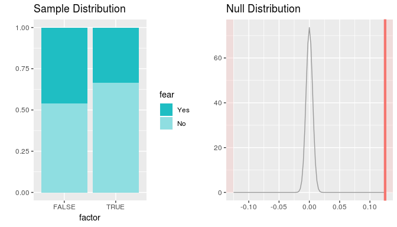

-   [Introduction](#introduction)
-   [Background](#background)
-   [Setup](#setup)
    -   [Load packages](#load-packages)
    -   [Load data](#load-data)
-   [Part 1: Data](#part-1-data)
-   [Part 2: Research question](#part-2-research-question)
-   [Part 3: Exploratory data analysis](#part-3-exploratory-data-analysis)
-   [Part 4: Inference](#part-4-inference)

Introduction
------------

This is a Data Analysis Project of the Inferential Statistics course by Duke University (Coursera).

Background
----------

For more than four decades, the General Social Survey (GSS) has studied the growing complexity of American society. It is the only full-probability, personal-interview survey designed to monitor changes in both social characteristics and attitudes currently being conducted in the United States.

The GSS gathers data on contemporary American society in order to monitor and explain trends and constants in attitudes, behaviors, and attributes. The GSS contains a standard core of demographic, behavioral, and attitudinal questions, plus topics of special interest. Among the topics covered are civil liberties, crime and violence, intergroup tolerance, morality, national spending priorities, psychological well-being, social mobility, and stress and traumatic events.

Setup
-----

### Load packages

``` r
library(ggplot2)
library(dplyr)
library(statsr)
```

    ## Warning: replacing previous import by 'Rcpp::evalCpp' when loading 'later'

``` r
library(stringr) 
```

### Load data

``` r
load("gss.Rdata")
```

------------------------------------------------------------------------

Part 1: Data
------------

The GSS is NORC’s (National Opinion Research Center) longest running project, and one of its most influential. The target population of the GSS is adults (18+) living in households in the United States. The GSS sample is drawn using an area probability design. Using NORC’s sample frame of United States addresses, a mix of urban, suburban, and rural National Frame Areas (NFAs) are scientifically selected to represent the nation. Segments are selected from these NFAs and addresses are selected from within each segment.

Since 1994, it has been conducted every other year. The survey (face to face) takes about 90 minutes to administer. As of 2014, 30 national samples with 59,599 respondents and 5,900+ variables have been collected.

Interviewers are instructed to visit every address in their assignment within two weeks of the start of data collection to determine the eligibility of each sampled address. An eligible address is that of a housing unit occupied with residents who speak either English or Spanish (since 2006).

As the GSS performs random sampling, we can assume the data it broadly generalizable to the US population.This is an observational study where data is collected in a way that does not directly interfere with how the data arise. In general, observational studies can provide evidence of a naturally occurring association between variables, but they cannot by themselves show a causal connection.

------------------------------------------------------------------------

Part 2: Research question
-------------------------

The USA has the highest number of gun owners in the World. It is the country where people have a deep history and a complex relationship with guns. Guns were a significant aspect of the social history of the U.S. from the outset and remain very popular and supported by the americans.

The purpose of this research is to check <b>whether there is a convincing evidence that people who have a firearm are more/less afraid to walk at night in neighborhood.</b>

Based on that question, the analysis will be done using the following variables:

<ul style="list-style-type:disc">
<li>
year - Year the response was obtained.
</li>
<li>
sex - Respondent gender.
</li>
<li>
fear - Whether respondent is afraid to walk alone at night.
</li>
<li>
owngun - Whether respondent have in home (or garage) any guns or revolvers.
</li>
<li>
pistol - Whether respondent have in home (or garage) any pistols.
</li>
<li>
shotgun - Whether respondent have in home (or garage) any shotguns.
</li>
<li>
rifle - Whether respondent have in home (or garage) any rifles.
</li>
</ul>

------------------------------------------------------------------------

Part 3: Exploratory data analysis
---------------------------------

Before performing inference, let's perform some exploratory data analysis. In addition, I created a new value <i>ownfirearm</i> to summarise firearm ownership from few fields (owngun, pistol, shotgun and rifle), so if a respondent has at least one type of firearm, the field <i>ownfirearm</i> has TRUE value. If a respondent refused to answer, the observation will be excluded to avoid bias.

``` r
firearm <- gss %>%
  select(year, sex, fear, owngun, pistol, shotgun, rifle)  %>%
  filter(!(is.na(sex)), !(is.na(fear))) %>%    # flter null valuse and data older than 10 years
  mutate(ownfirearm = case_when(
                   str_detect(owngun, 'Yes') ~ TRUE,
                   str_detect(pistol, 'Yes') ~ TRUE,
                   str_detect(shotgun, 'Yes') ~ TRUE,
                   str_detect(rifle, 'Yes') ~ TRUE,
                   str_detect(owngun, 'Refused') ~ NA,
                   str_detect(pistol, 'Refused') ~ NA,
                   str_detect(shotgun, 'Refused') ~ NA,
                   str_detect(rifle, 'Refused') ~ NA,
                   TRUE ~ FALSE)
         ) %>%
  mutate(fear1 = ifelse(fear == "Yes", TRUE, FALSE)) %>%
  filter(!(is.na(ownfirearm)))          # filter 'Refused' answer to exclude bias


summary(firearm)
```

    ##       year          sex         fear           owngun          pistol     
    ##  Min.   :1973   Male  :15014   Yes:13890   Yes    :13944   Yes    : 7398  
    ##  1st Qu.:1982   Female:18970   No :20094   No     :19934   No     :26230  
    ##  Median :1991                              Refused:    0   Refused:   28  
    ##  Mean   :1991                              NA's   :  106   NA's   :  328  
    ##  3rd Qu.:2000                                                             
    ##  Max.   :2012                                                             
    ##     shotgun          rifle       ownfirearm        fear1        
    ##  Yes    : 8423   Yes    : 8290   Mode :logical   Mode :logical  
    ##  No     :25198   No     :25330   FALSE:20040     FALSE:20094    
    ##  Refused:   28   Refused:   28   TRUE :13944     TRUE :13890    
    ##  NA's   :  335   NA's   :  336   NA's :0         NA's :0        
    ##                                                                 
    ## 

``` r
fear_ownfirearm <- table(firearm$fear,firearm$ownfirearm)
fear_ownfirearm
```

    ##      
    ##       FALSE  TRUE
    ##   Yes  9219  4671
    ##   No  10821  9273

``` r
prop.table(fear_ownfirearm, 1)
```

    ##      
    ##           FALSE      TRUE
    ##   Yes 0.6637149 0.3362851
    ##   No  0.5385190 0.4614810

The table indicates there is a negative difference between respondents who are afraid to walk at night in neighouhood and firearm posession.

Let's have a look to the precentage of firearm ownership and the percentage of people who are afraid to walk at night in a neighbourhood for the period of 40 years:

``` r
firearm_grp <- firearm %>%
      group_by(year) %>%
      summarise(firearm_prop = mean(ownfirearm), fear_prop = mean(fear1),  firearm_true=sum(ownfirearm), fear_true=sum(fear1), n=n())

ggplot(firearm_grp, aes(x = as.numeric(year), y = firearm_prop, group = year)) +
  geom_bar(stat = "identity", alpha=0.9, width = 0.90, aes(fill="bars")) +
  geom_point(aes(y = fear_prop)) +
  geom_line(aes(y = fear_prop, group = 1, color = "line")) +
  scale_colour_manual(values = c("black"), labels=c("% of people who fear to walk at night")) + 
  scale_fill_manual(values = c("tan1"), labels=c("% of people who has a firearm")) +
  labs(x = "Year", y = "Proportion",title = "Proportion of Firearm Ownership vs. Fear") +
  theme(legend.position="bottom",legend.direction="vertical") +
  guides(colour = guide_legend(""), fill = guide_legend("")) +
  scale_x_continuous(breaks = seq(min(firearm_grp$year), max(firearm_grp$year), by = 2))
```


The trend indicates that there is a correltation between these 2 parameters. So, let's visualise it in different way:

``` r
ggplot(firearm,  aes(x=fear,fill=factor(ownfirearm))) + 
  geom_bar(position = "fill") +
 # facet_grid(.~fear) +
  labs(x="Fear to walk at night", y="Proportion", title="Fear to walk at night vs. firearm ownership") +
  scale_fill_manual(values=c("#999999", "#E69F00"), 
                       name="Firearm ownership",
                       breaks=c(TRUE, FALSE),
                       labels=c("Have firearm","Don't have firearm")) +
  guides(color=guide_legend(), size = guide_legend()) +
  coord_flip()
```


The visulal plots indicates that the people who have firearm are more confident and has less fear. So the research question do have support in EDA, but let's perform actual inference to confirm that.

------------------------------------------------------------------------

Part 4: Inference
-----------------

<b>Hypothesis Testing</b>

The null hypothesis (H0) is that the respondent’s fear to walk at night in neighborhood and having a firearm are independent variables.

The alternative hypothesis (HA) is that a fear to walk at night in neighborhood are more/less among respondents who have a firearm.

<b>Statistical Method</b>

Since the dataset consists of two poportions (fear to walk at nigh and firearm ownership), adequate test to be used is calclulation of of two sample proportion.

<b>Conditions check</b>

First the conditions must be verified. Because each group is a simple random sample from less than 10% of the population, the observations are independent, both within the samples and between the samples. The success-failure condition also holds for each sample.

``` r
fear_ownfirearm
```

    ##      
    ##       FALSE  TRUE
    ##   Yes  9219  4671
    ##   No  10821  9273

<b>Inference</b>

Finally, we can perform the inference calculation

``` r
prop.test(table(firearm$fear1,firearm$ownfirearm)) 
```

    ## 
    ##  2-sample test for equality of proportions with continuity
    ##  correction
    ## 
    ## data:  table(firearm$fear1, firearm$ownfirearm)
    ## X-squared = 531.52, df = 1, p-value < 2.2e-16
    ## alternative hypothesis: two.sided
    ## 95 percent confidence interval:
    ##  -0.1357085 -0.1146834
    ## sample estimates:
    ##    prop 1    prop 2 
    ## 0.5385190 0.6637149

``` r
inference(x = factor(ownfirearm), y = fear, data = firearm, statistic = "proportion", type = "ht", null = 0,  method = "theoretical", success = "Yes", alternative = "twosided") 
```

    ## Response variable: categorical (2 levels, success: Yes)
    ## Explanatory variable: categorical (2 levels) 
    ## n_FALSE = 20040, p_hat_FALSE = 0.46
    ## n_TRUE = 13944, p_hat_TRUE = 0.335
    ## H0: p_FALSE =  p_TRUE
    ## HA: p_FALSE != p_TRUE
    ## z = 23.0658
    ## p_value = < 0.0001



As can be seen above, p-value is low (&lt; 0.05).

<b>Result interpretation</b> Since the p-value is below 5% significance value, we can conclude that there is sufficient evidence to reject H0 (null hypothesis). In the context of the research question, it means that there is evidence that firearm possession influence people confidence to walk at night.
